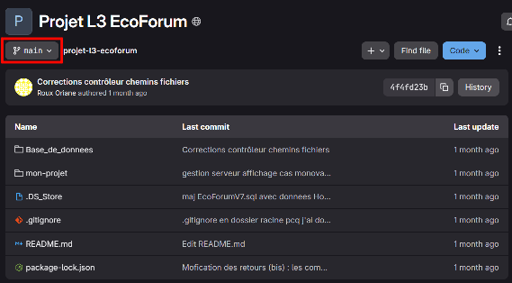
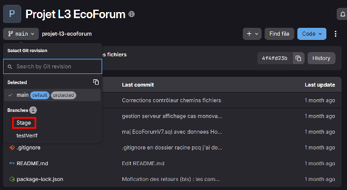
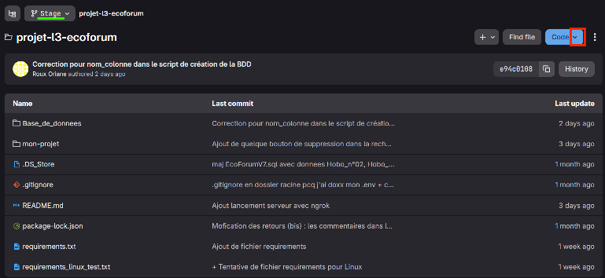
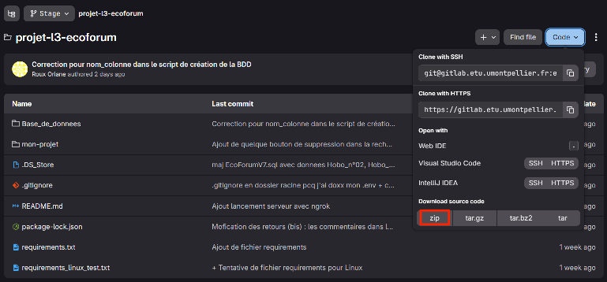
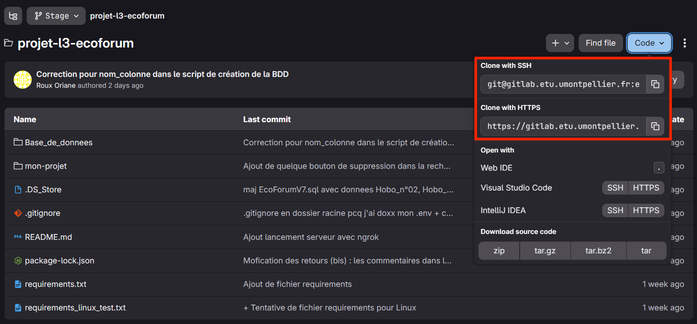

# Projet L3 EcoForum 2025-2026

[Lien vers le drive du projet](https://drive.google.com/drive/folders/1pDWjVzZtVJSltq6X1iO6_A5gh6dT9goN)

## Nom des étudiants en L3 informatique
- Aurore Minihot
- Éléa Weber
- Ernest Niederman
- Francisco Ernesto Suarez Roca
- Maeva Zerbib
- Olivia Aing
- Oriane Roux

## Nom des encadrants
- Anne-Muriel Arigon
- Marine Zwicke
- Annie Chateau


<!--ENSUITE :

- soit sur pgAdmin : créer une bdd vide EcoForumV7, clic droit sur la base, "Query Tool", Menu File, Open, choisir EcoForumV7.sql, Execute / Play
- soit ligne de cmd : psql -U postgres -d EcoForumV7 -f EcoForumV7.sql

se mettre dans dossier racine : npm install (installe tous les imports et dépendances)
se mettre dans /mon-projet
pour lancer le client et le serveur en simultané : lancer "npm run dev:all"
-->


Carte des zones du campus avec instruments de mesure :
https://www.google.com/maps/d/u/1/viewer?ll=43.63208270185771%2C3.8634961583030103&z=17&mid=1zQxZ4ap-1xYahwCcU7LALE8AnQ5Dhs0

## Téléchargement du Projet via gitlab

1. Commencez par basculer sur la branche "Stage". Pour cela, cliquez sur main, puis stage, comme indiqué par les encadrés rouges ci-dessous.



2. Si vous êtes bien sur la bonne branche, vous devriez voir "Stage" en haut, comme souligné en vert. Cliquez ensuite sur le menu déroulant de "Code" en bleu, comme encadré en rouge.  


3. À partir de là, vous avez plusieurs options pour "cloner" le projet.
* **Si vous ne voulez pas modifier les fichiers sources par la suite** (accès simple), téléchargez le .zip, comme indiqué sur l'image en dessous.  

* **Si vous souhaitez modifier les fichiers sources par la suite** (accès développeur), choisissez votre mode préféré entre https et ssh. Puis, dans un terminal, cloner le dépôt avec `git clone <lien copié>` et suivez la procédure habituelle.  
  
Vérifiez que vous êtes bien sur la bonne branche avec `git status`. Autrement, faites `git checkout -b Stage`.  

## Création de la base de données en utilisant PostgreSQL comme SGBD

### Installation de PostgreSQL

* Rendez vous sur le [site officiel de PostgreSQL](https://www.postgresql.org/download/) : https://www.postgresql.org/download/

* Choisissez l'onglet correspondant à votre système d'exploitation.
    - Pour les utilisateurs de Linux, l'installation dépend de votre architecture, et se fera en ligne de commande.
    - Pour les utilisateurs de Windows et MacOS, cliquez sur le lien "Download the installer" comme indiqué sur l'image ci-dessous. Après quoi, vous serez redirigés vers une page edb. Ici, téléchargez la version de PostgreSQL correspondant à votre système d'exploitation. **Le minimum requis est la version 18.4** avec laquelle a été développé le projet.

* Lancez l'exécutable pour commencer l'installation.
    1. Après avoir autorisé l'ouverture, vous devriez tomber sur l'assistant d'installation de pgAdmin4.
    2. Choisissez le chemin d'installation du logiciel (ou laissez-le par défaut).
    3. Sur le menu des options, prenez soin à ce que tout soit coché comme ci-dessous, **surtout pgAdmin4**.
    4. Choisissez le chemin de sauvegarde de vos données pour le logiciel (ou laissez-le par défaut).
    5. Choisissez un mot de passe pour utiliser le logiciel (inutile d'en faire un trop compliqué : celui-ci restera en local). Comme toujours, n'utilisez pas un mot de passe que vous utilisez ailleurs !
    6. Choisissez le port sur lequel votre serveur sera accessible (ou laissez-le par défaut).
    7. Choisissez la localisation du nouveau cluster de base de données (celle par défaut fonctionne très bien aussi).
    8. Vous devriez ensuite avoir respectivement : le résumé de l'installation, un message annonçant que le logiciel est prêt à être installé, puis le démarrage de l'installation. Cette opération peut prendre un certain temps (un thème qui risque d'être récurrent pour la suite).


    
### Configuration de PostgreSQL

#### pgAdmin est un logiciel dont la lenteur admirable fait partie de l'expérience. NE CLIQUEZ PAS DE PARTOUT.


- Configurez postgre en créant un mot de passe

### Création de la base et des tables depuis pgAdmin4

- Création et nommage de la base de données :  
` Servers > PostgreSQL 18 > Databases ` puis ` clic droit > Create > Database ` puis remplir le champ ` Database ` avec le nom que vous voulez donner à la base puis ` Save
`

- Création des tables : ouvrir et lancer le fichier `Script_creation_tables.sql` présent dans le dossier ` Base_de_donnees `

- Pour permettre la connexion des scripts à la base de données, il faut créer un fichier `.env` dans le dossier ` Base_de_donnees `. Ci-dessous un exemple du contenu du fichier dans lequel il faudra remplacer les informations par celles de votre base.
` DB_HOST `, `DB_PORT` et `DB_USER` sont retrouvables en faisant `clic droit sur PostgreSQL 18 > Connection`.
`DB_HOST` correspond au champ `Host name`, `DB_PORT` au champ `Port` et `DB_USER` au champ `Username`.

<!--
- Créez une base avec le nom et le mdp de votre choix
- Lancez le script de création de base présent dans `"./Base_de_donnees/Script_creation_tables.sql"`
- Créez un fichier .env dans le dossier Base_de_donnees 

Ceci n'est qu'un exemple, remplacez ces informations par celles de votre base de données.
-->

```bash
DB_HOST=localhost
DB_PORT=5432
DB_NAME=nom_base
DB_USER=postgres
DB_PASSWORD=mdp
```

Le .env est ajouté dans .gitignore pour ne pas que le fichier soit push dans le gitlab (sécurité).

## Requis pour lancer l'application (sans dockerisation)

### Installer NodeJS et npm si besoin

- Vérifiez si NodeJS et npm sont déjà installés ou non sur votre ordinateur avec :
```bash
node -v
npm -v
```
- S'ils ne le sont pas (la version ne s'affiche pas), installez les depuis `"nodejs.org"`
    - Installez la version LTS la plus récente
    - Cochez 'add to Path' et 'install npm package manager'

### Lancer l'application

__Installer les dépendances :__  
Mettez-vous dans `"projet-l3-ecoforum/mon-projet"` pour avoir accès au `"package.json"` qui contient les dépendances à installer.
```bash
npm install 
```
__S'il y a des problèmes avec une dépendance :__ 
```
npm install 'dependance'
```
__Lancer l'application avec vite (en local) :__ 
```bash
npm run dev:all
```
L'application sera disponible à l'adresse "http://localhost:5173/".

__Lancer l'application avec ngrok (en mode distant)__ :

- Installer ngrok : se créer un compte sur le site `https://ngrok.com/` puis installer en fonction du système d'exploitation de votre machine.

- Configurer ngrok en ajoutant le token d'authentification retrouvable dans l'onglet `Setup & Installation` de votre compte :  
```bash
ngrok config add-authtoken <YOUR_AUTHTOKEN>
```

- Lancer ngrok : 
```bash
ngrok http <port>
```

- Lancer le serveur : 
```bash
npm run build
npm run server
```
L'application sera ensuite disponible à une adresse fournie par ngrok.


## Requis pour lancer les scripts sans l'application

### Appel au controleur pour lancer des scripts

Placez-vous tout d'abord à la base du projet `"projet-l3-ecoforum"`.

__Sous Linux :__ 
```bash
python/python3 -m venv .venv
. .venv/bin/activate
pip install -r requirements.txt
```

__Sous Windows :__
```bash
python/python3 -m venv .venv
.venv/Scripts/activate.bat
pip install -r requirements.txt
```

**Pour lancer la vérification/intégration d'un fichier de mesure ou de métadonnées depuis le controleur :**
```bash
cd mon-projet
python/python3 ../Base_de_donnees/controleur.py 'chemin_fichier_JSON'
```

### JSON à fournir au controleur

Les champs commençant par une * sont obligatoires.

__Structure type d'un JSON de vérification :__ 
```json
* "script" : "verification",
* "chemin_source" : "chemin_du_fichier_dont_on_veut_integrer_les_donnees",
* "nom_outil" : "nom_de_l'instrument_de_mesure",
* "num_instrument" : "numero_defini_par_Marine_Zwicke"
```

__Structure type d'un JSON d'intégration de métadonnées :__ 
```json
* "script" : "inte_metadonnees",
# Parmis (Personne, Capteur, Localisation, Projet)
# Et (Projet => Personne)
* "type_script" : ["", ...],
# Dans le même ordre que les scripts
* "fichier_donnees" : ["nom_de_fichier_contenant_les_metadonnees", ...],
"date_import" : "YYYY-MM-DD HH:MM:SS",
"commentaire" : "...",

* "mail_responsable" : "nom@example.com",
* "est_responsable_fichier" : false,
# A ajouter si la personne n'est pas déjà un responsable
"nom" : "nom",
"prenom" : "prenom",
"fonction" : "...",
"encadre_par" : "nom2@example.com"
```

__Structure type d'un JSON d'intégration de fichier de mesure :__ 
```json
* "script" : "integration",
* "chemin_source" : "chemin_du_fichier_dont_on_veut_integrer_les_donnees",
* "nom_outil" : "nom_de_l'instrument_de_mesure",
* "num_instrument" : "numero_defini_par_Marine_Zwicke",
# Exemple 'csv', 'xlsx'
"extension" : "...",
"date_collecte" : "YYYY-MM-DD HH:MM:SS",
"date_import" : "YYYY-MM-DD HH:MM:SS",
"commentaire" : "...",

* "mail_responsable" : "nom@example.com",
* "est_responsable_fichier" : false,
# A ajouter si la personne n'est pas déjà un responsable
"nom" : "nom",
"prenom" : "prenom",
"fonction" : "...",
"encadre_par" : "nom2@example.com"
```