# Projet L3 EcoForum 2025-2026

## Nom des étudiants en L3 informatique
- Aurore Minihot
- Éléa Weber
- Ernest Niederman
- Francisco Ernesto Suarez Roca
- Maeva Zerbib
- Olivia Aing
- Oriane Roux

## Nom des encadrants
- Anne-Muriel Arigon
- Marine Zwicke
- Annie Chateau


<!--ENSUITE :

- soit sur pgAdmin : créer une bdd vide EcoForumV7, clic droit sur la base, "Query Tool", Menu File, Open, choisir EcoForumV7.sql, Execute / Play
- soit ligne de cmd : psql -U postgres -d EcoForumV7 -f EcoForumV7.sql

se mettre dans dossier racine : npm install (installe tous les imports et dépendances)
se mettre dans /mon-projet
pour lancer le client et le serveur en simultané : lancer "npm run dev:all"
-->

## Liens utiles

- [Carte des zones du campus avec instruments de mesure](https://www.google.com/maps/d/u/1/viewer?ll=43.63208270185771%2C3.8634961583030103&z=17&mid=1zQxZ4ap-1xYahwCcU7LALE8AnQ5Dhs0)
- [Drive du projet](https://drive.google.com/drive/folders/1pDWjVzZtVJSltq6X1iO6_A5gh6dT9goN)
- [Dictionnaire des données de la base de données EcoForUM](https://docs.google.com/document/d/1v3GczGLe2le9Q79rml1vqW_xhcUc0KFQiYP5INEfUc4/edit?tab=t.0#heading=h.l1curom0k6it)

## Téléchargement du Projet via gitlab

1. Commencez par basculer sur la branche "Stage". Pour cela, cliquez sur main, puis stage, comme indiqué par les encadrés rouges ci-dessous.


2. Si vous êtes bien sur la bonne branche, vous devriez voir "Stage" en haut, comme souligné en vert. Cliquez ensuite sur le menu déroulant de "Code" en bleu, comme encadré en rouge.  


3. À partir de là, vous avez plusieurs options pour "cloner" le projet.
* **Si vous ne voulez pas modifier les fichiers sources par la suite** (accès simple), téléchargez le .zip, comme indiqué sur l'image en dessous.  

* **Si vous souhaitez modifier les fichiers sources par la suite** (accès développeur), choisissez votre mode préféré entre https et ssh. Puis, dans un terminal, cloner le dépôt avec `git clone <lien copié>` et suivez la procédure habituelle.  
  
Vérifiez que vous êtes bien sur la bonne branche avec `git status`. Autrement, faites `git checkout -b Stage`.  

## Création de la base de données en utilisant PostgreSQL comme SGBD

### Installation de PostgreSQL

* Rendez vous sur le [site officiel de PostgreSQL](https://www.postgresql.org/download/) : https://www.postgresql.org/download/

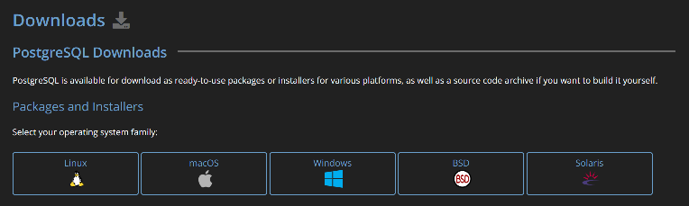

* Choisissez l'onglet correspondant à votre système d'exploitation.
    - Pour les utilisateurs de Linux, l'installation dépend de votre architecture, et se fera en ligne de commande.
    - Pour les utilisateurs de Windows et MacOS, cliquez sur le lien "Download the installer" comme indiqué sur l'image ci-dessous.   
    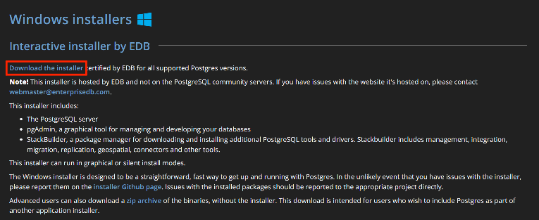  
    Après quoi, vous serez redirigés vers une page edb. Ici, téléchargez la version de PostgreSQL correspondant à votre système d'exploitation. **Le minimum requis est la version 18.4** avec laquelle a été développé le projet.  
    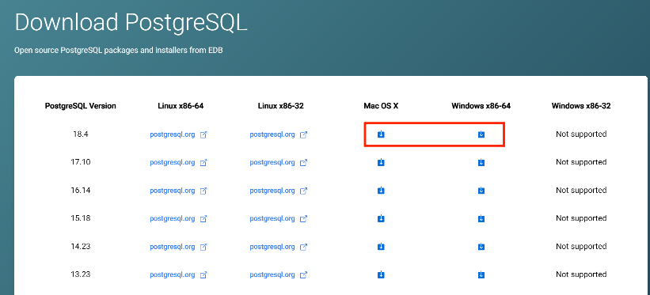

* Lancez l'exécutable pour commencer l'installation.
    1. Après avoir autorisé l'ouverture, vous devriez tomber sur l'assistant d'installation de pgAdmin4.  
    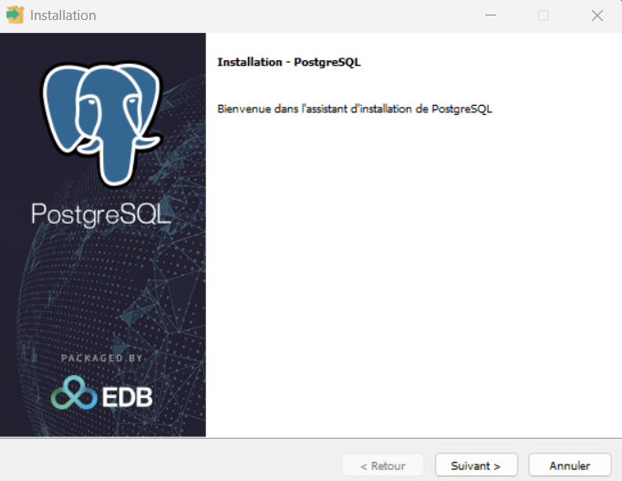
    2. Choisissez le chemin d'installation du logiciel (ou laissez-le par défaut).  
    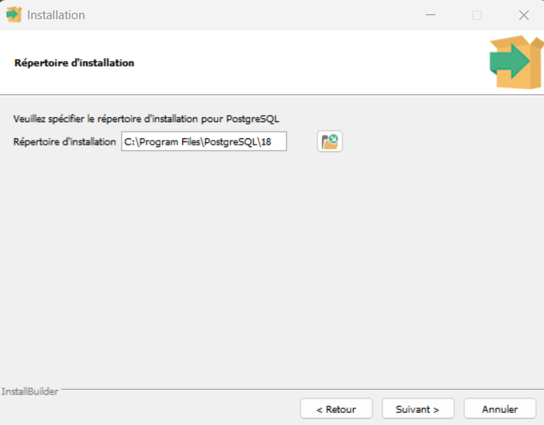
    3. Sur le menu des options, prenez soin à ce que tout soit coché comme ci-dessous, **surtout pgAdmin4**.  
    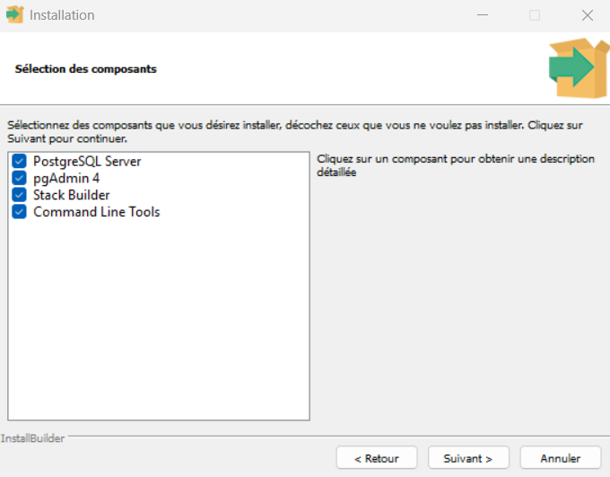
    4. Choisissez le chemin de sauvegarde de vos données pour le logiciel (ou laissez-le par défaut).  
    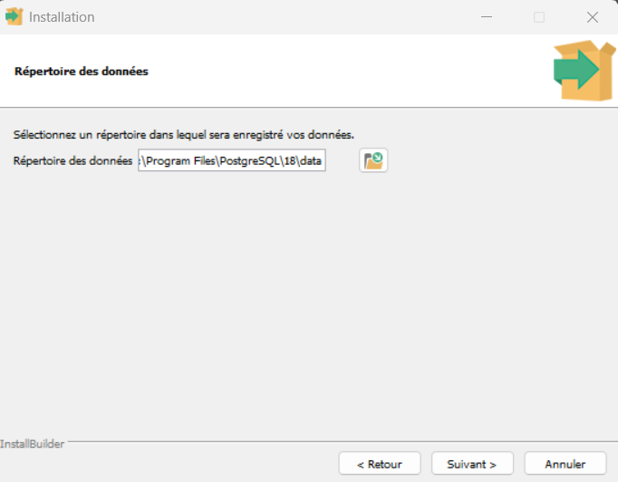
    5. Choisissez un mot de passe pour utiliser le logiciel (inutile d'en faire un trop compliqué : celui-ci restera en local). Comme toujours, n'utilisez pas un mot de passe que vous utilisez ailleurs !  
    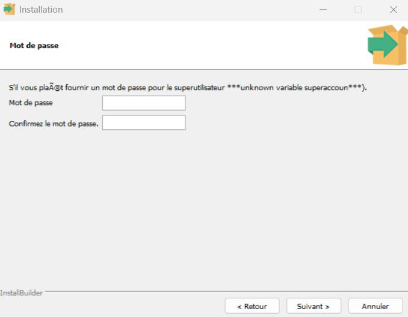
    6. Choisissez le port sur lequel votre serveur sera accessible (ou laissez-le par défaut).  
    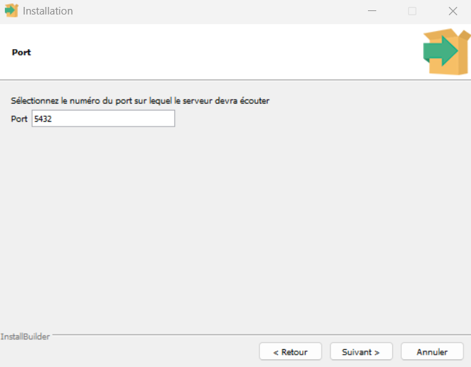
    7. Choisissez la localisation du nouveau cluster de base de données (celle par défaut fonctionne très bien aussi).  
    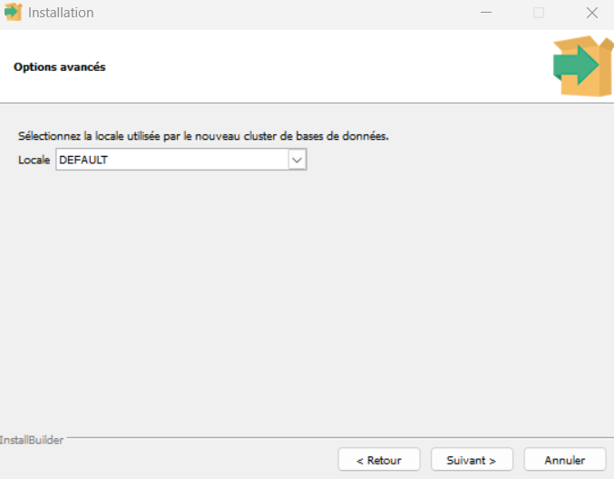
    8. Vous devriez ensuite avoir respectivement : le résumé de l'installation, un message annonçant que le logiciel est prêt à être installé, puis le démarrage de l'installation. **Cette opération peut prendre un certain temps** (un thème qui risque d'être récurrent pour la suite).  
    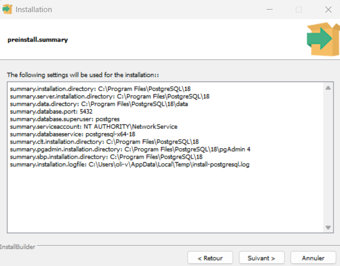  
    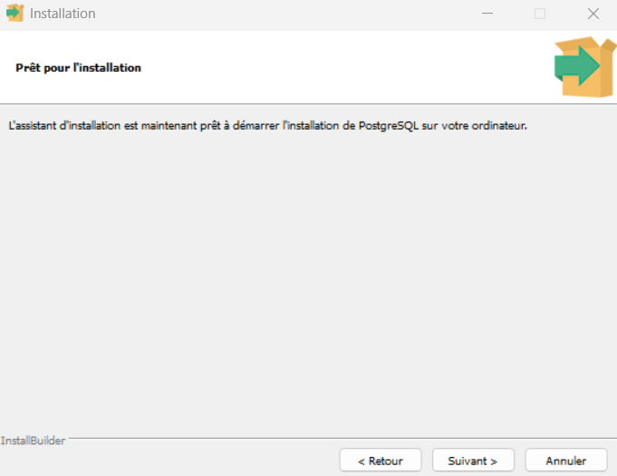  
    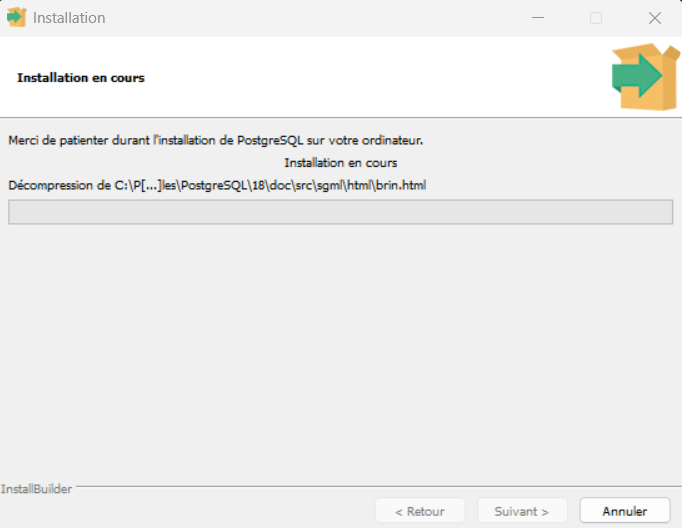  
    9. Après l'installation, il faut **absolument décocher** le lancement de Stack Builder.  
    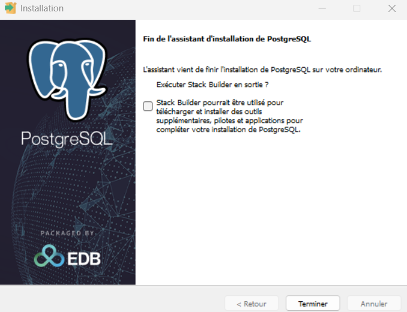

Vous pouvez maintenant passer à la configuration de PostgreSQL.


    
### Configuration de PostgreSQL

#### pgAdmin est un logiciel dont la lenteur admirable fait partie de l'expérience. NE CLIQUEZ PAS DE PARTOUT.
*Pour des raisons de lisibilité, nous ne préciserons donc pas que chaque opération faite dans pgAdmin4 peut prendre **un certain temps**.*

* Lancez pgAdmin4
* Entrez le mot de passe que vous avez créé lors de l'installation du logiciel.  
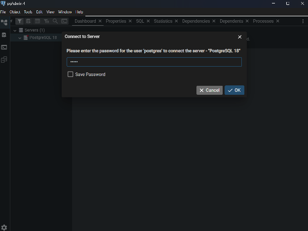

### Création de la base et des tables depuis pgAdmin4

#### pgAdmin est un logiciel dont la lenteur admirable fait partie de l'expérience. NE CLIQUEZ PAS DE PARTOUT.
*Pour des raisons de lisibilité, nous ne préciserons donc pas que chaque opération faite dans pgAdmin4 peut prendre **un certain temps**.*

**Création et nommage de la base de données**  
- Dans l'onglet à gauche, développez `Servers`,`PostgreSQL 18` puis `Databases`. Faites un clic droit sur `Databases` pour accéder aux sous-menus `Create` puis `Database`. Cliquez sur `Database`.  
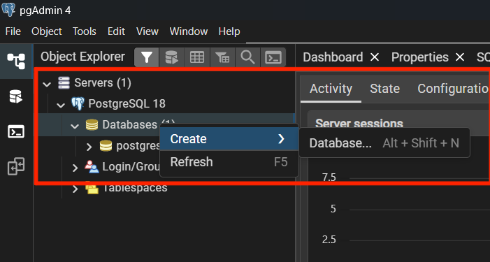
- Une fenêtre de dialogue s'ouvre. Remplissez le champ `Database` avec le nom que vous voulez donner à la base, puis cliquez sur `Save`. Dans l'exemple ci-dessous, notre `Database` est appelée ECOFORUM.  
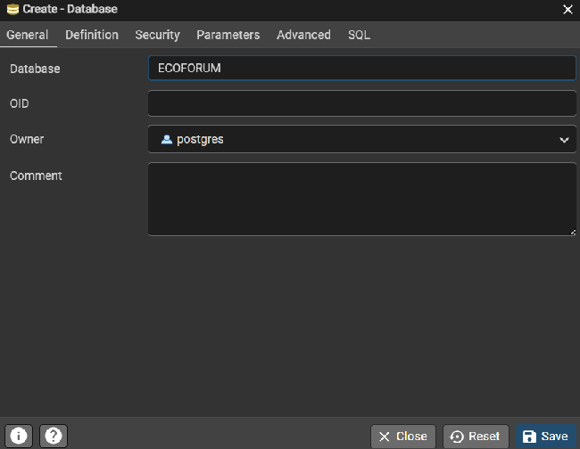  

**Création des tables** 
- Faire un clic droit sur votre `Database` créée à l'étape précédente, pour ouvrir le `Query Tool`.  
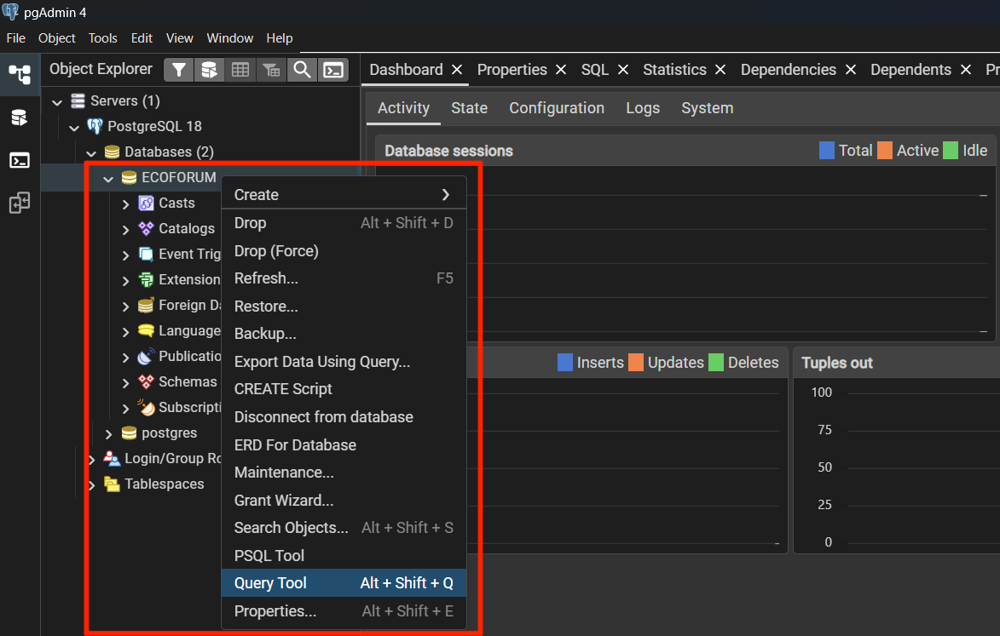  
- Depuis le Query Tool, ouvrir, dans le dossier du projet, `Base_de_donnees > Script_creation_tables.sql`.  
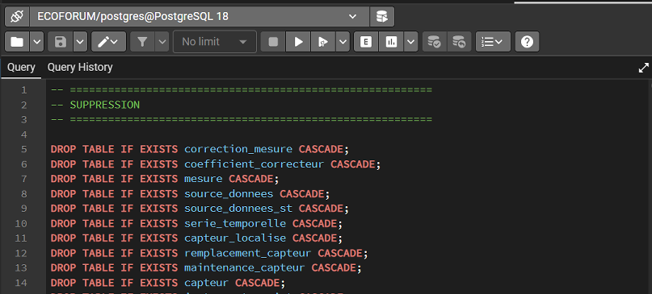
- Lancez le script en appuyant sur la flèche ( ► ). Si tout se passe bien, vous devriez voir de popups verts apparaître en bas de votre fenêtre.  
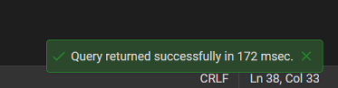

### Connexion des scripts à la base de données

* Dans le dossier `Base_de_donnees`, créer un fichier `.env`. Pour cela, il y a plusieurs manières de faire :
    - Sur Windows ou MacOS, vous pouvez créer un fichier .env vide depuis une interface de développement, ou notes, puis vérifier qu'il n'y a pas d'extension.
    - Sur Linux, ouvrez un terminal, placez-vous dans le dossier, et faites la commande `touch .env`  

* Pour ouvrir le fichier depuis l'explorateur de fichiers :
    - Sur Windows ou Linux, vous devrez activer l'affichage de fichiers cachés.  
    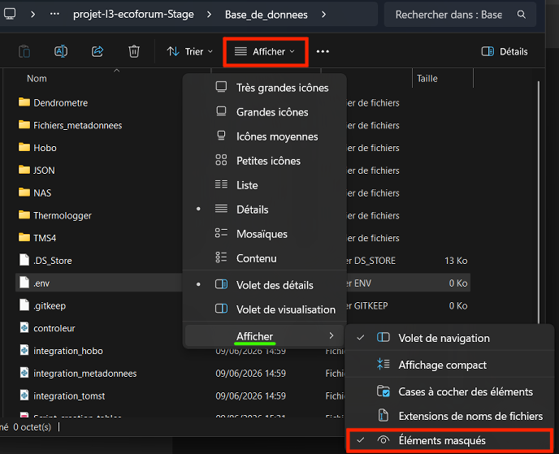
    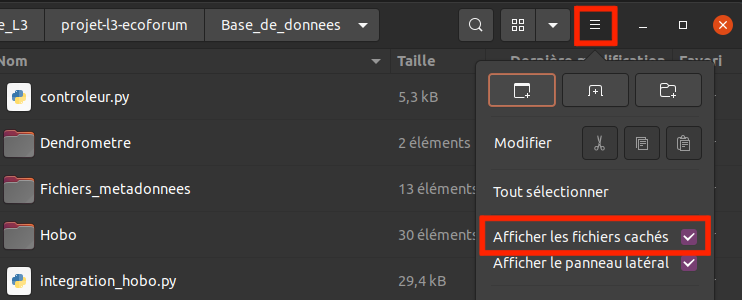
    - Sur MacOS, vous trouverez des ressources en ligne pour vous guider. Nous n'avons pas le matériel pour vous faire une démonstration.  

* Remplissez le fichier `.env` avec le texte suivant :  
```bash
DB_HOST=localhost
DB_PORT=5432
DB_NAME=<nom_base>
DB_USER=postgres
DB_PASSWORD=<mdp>
```

* Remplacez les informations du texte ci-dessus avec celle de votre base de données.
    - `DB_HOST`, `DB_PORT` et `DB_USER` sont retrouvables sur pgAdmin.  
    Pour cela, faites un clic droit sur `PostgreSQL 18` et allez sur `Properties`  
    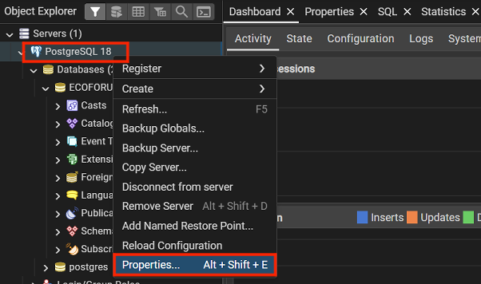  
    Une boîte de dialogue s'ouvrira. Cliquez sur l'onglet `Connection`.  
    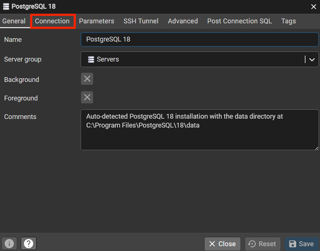  
    Vous trouverez les différentes informations comme soulignées en vert ci-dessous.  
    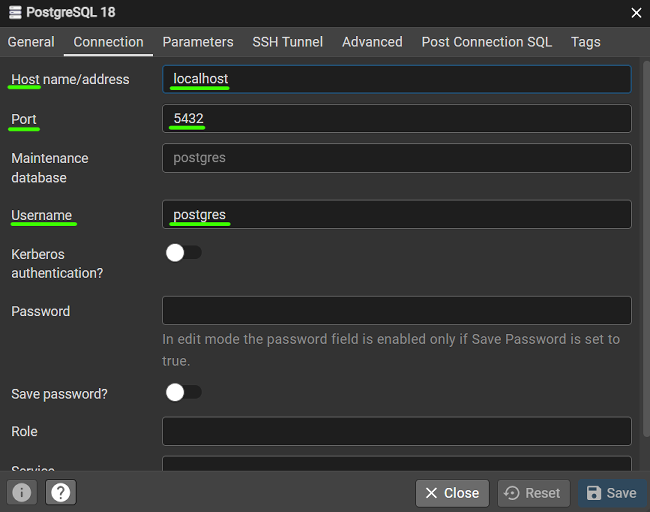  
    - Remplacez `<nom_base>` par le nom de votre base choisi lors de la création de celle-ci.
    - Remplacez `<mdp>` par le mot de passe que vous utilisez pour ouvrir pgAdmin4.

<!--
- Créez une base avec le nom et le mdp de votre choix
- Lancez le script de création de base présent dans `"./Base_de_donnees/Script_creation_tables.sql"`
- Créez un fichier .env dans le dossier Base_de_donnees 

Ceci n'est qu'un exemple, remplacez ces informations par celles de votre base de données.
-->


Le .env est dans le .gitignore pour ne pas que le fichier soit ajouté au gitlab (sécurité).

## Requis pour lancer l'application (sans dockerisation)

### Installer NodeJS et npm si besoin

Vérifiez si NodeJS et npm sont installés.  
- Ouvrez un terminal
- Entrez les commandes suivantes :
```bash
node -v
npm -v
```  
S'ils sont installés, leur version devrait s'afficher.

S'ils ne sont pas installés (la version ne s'affiche pas), vous pouvez trouver les packages sur [nodejs.org](https://nodejs.org/fr/download) :  
* Pour notre installation, nous utiliserons un Node.js® préconstruit indiqué ci-dessous.  
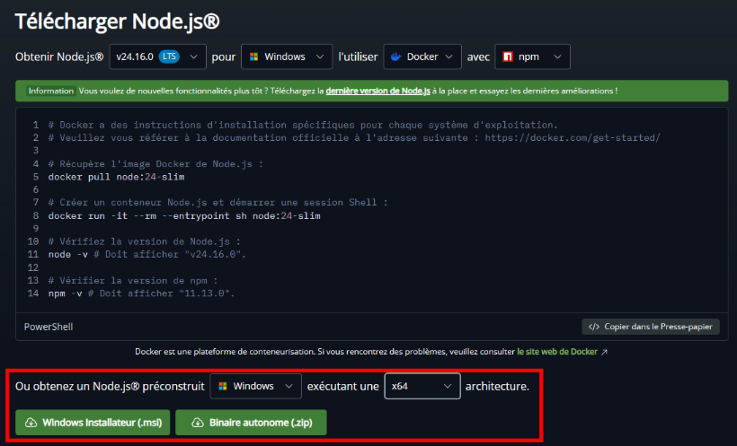  
* Vous devez connaître l'architecture de votre ordinateur pour choisir la bonne version. Pour cela :
    - Si vous êtes sur Windows :  
        - Ouvrez les `Paramètres`
        - Allez dans l'onglet `Système`, puis cliquez sur `Informations système`
        - Dans les informations sur l'appareil, vous verrez `Type du système`, qui vous indiquera l'architecture de votre ordinateur (x64 ou ARM64)
    - Si vous êtes sur MacOS :
        - Cliquez sur le logo d'Apple en haut à gauche de votre écran. Une fenêtre devrait s'ouvrir.
        - Cliquez sur `À propos de ce Mac`
        - Dans la section `Vue d'ensemble`, vous verrez `Puce`.
        - Si votre puce est une puce Apple (M1 ou M2), vous avez une architecture en ARM64. Si c'est une Intel, vous êtes normalement en x64.
    - Si vous êtes sur un Linux, comme toujours, la ligne de commande adaptée est votre meilleure amie.
* Téléchargez ensuite l'installateur adapté à votre ordinateur selon les instructions au-dessus, et lancez-le.
* Lors de l'installation, cochez bien l'option `install npm package manager`. **Si vous êtes sur Windows**, n'oubliez pas de cocher également l'option `add to Path`.

### Lancer l'application

__Installer les dépendances :__  
- Ouvrez un terminal.
- Mettez-vous dans `"projet-l3-ecoforum/mon-projet"` grâce à la commande `cd <chemin_du_dossier>`, en remplaçant `<chemin_du_dossier>` par le chemin du dossier. Cela vous donnera accès au `"package.json"` qui contient les dépendances à installer.
- Entrez la commande suivante :
```bash
npm install 
```
__S'il y a des problèmes avec une dépendance :__ 
- Entrez la commande suivante :
```bash
npm install 'dependance'
```
__Lancer l'application avec vite (en local) :__ 
- Entrez la commande suivante :
```bash
npm run dev:all
```
L'application sera disponible à l'adresse "http://localhost:5173/". Vous pourrez y accéder via un navigateur internet, et seulement sur votre machine.

__Lancer l'application avec ngrok (en mode distant)__ :

- Installer ngrok : se créer un compte sur le site `https://ngrok.com/` puis installer en fonction du système d'exploitation de votre machine.  

Les commandes suivantes se font via le terminal.

- Configurer ngrok en ajoutant le token d'authentification retrouvable dans l'onglet `Setup & Installation` de votre compte :  
```bash
ngrok config add-authtoken <YOUR_AUTHTOKEN>
```

- Lancer ngrok : 
```bash
ngrok http <port>
```

- Lancer le serveur : 
```bash
npm run build
npm run server
```
L'application sera ensuite disponible à une adresse fournie par ngrok.


## Requis pour lancer les scripts sans l'application

### Appel au controleur pour lancer des scripts

Ouvrez un terminal et placez-vous à la base du projet `"projet-l3-ecoforum"` de la même manière que précédemment.  
Pour les commandes suivantes, n'écrivez que `python` **OU** `python3`, pas les deux. Le mot-clef de python3 dépend généralement de votre ordinateur.

__Sous Linux :__ 
```bash
python -m venv .venv
. .venv/bin/activate
pip install -r requirements.txt
```

__Sous Windows :__
```ps1
python -m venv .venv
.venv\Scripts\activate.bat
pip install -r requirements.txt
```

**Pour lancer la vérification/intégration d'un fichier de mesure ou de métadonnées depuis le controleur :**
```bash
cd mon-projet
python ../Base_de_donnees/controleur.py 'chemin_fichier_JSON'
```

### JSON à fournir au controleur

Les champs commençant par une * sont obligatoires.

__Structure type d'un JSON de vérification :__ 
```json
* "script" : "verification",
* "chemin_source" : "chemin_du_fichier_dont_on_veut_integrer_les_donnees",
* "nom_outil" : "nom_de_l'instrument_de_mesure",
* "num_instrument" : "numero_defini_par_Marine_Zwicke"
```

__Structure type d'un JSON d'intégration de métadonnées :__ 
```json
* "script" : "inte_metadonnees",
# Parmis (Personne, Capteur, Localisation, Projet)
# Et (Projet => Personne)
* "type_script" : ["", ...],
# Dans le même ordre que les scripts
* "fichier_donnees" : ["nom_de_fichier_contenant_les_metadonnees", ...],
"date_import" : "YYYY-MM-DD HH:MM:SS",
"commentaire" : "...",

* "mail_responsable" : "nom@example.com",
* "est_responsable_fichier" : false,
# A ajouter si la personne n'est pas déjà un responsable
"nom" : "nom",
"prenom" : "prenom",
"fonction" : "...",
"encadre_par" : "nom2@example.com"
```

__Structure type d'un JSON d'intégration de fichier de mesure :__ 
```json
* "script" : "integration",
* "chemin_source" : "chemin_du_fichier_dont_on_veut_integrer_les_donnees",
* "nom_outil" : "nom_de_l'instrument_de_mesure",
* "num_instrument" : "numero_defini_par_Marine_Zwicke",
# Exemple 'csv', 'xlsx'
"extension" : "...",
"date_collecte" : "YYYY-MM-DD HH:MM:SS",
"date_import" : "YYYY-MM-DD HH:MM:SS",
"commentaire" : "...",

* "mail_responsable" : "nom@example.com",
* "est_responsable_fichier" : false,
# A ajouter si la personne n'est pas déjà un responsable
"nom" : "nom",
"prenom" : "prenom",
"fonction" : "...",
"encadre_par" : "nom2@example.com"
```